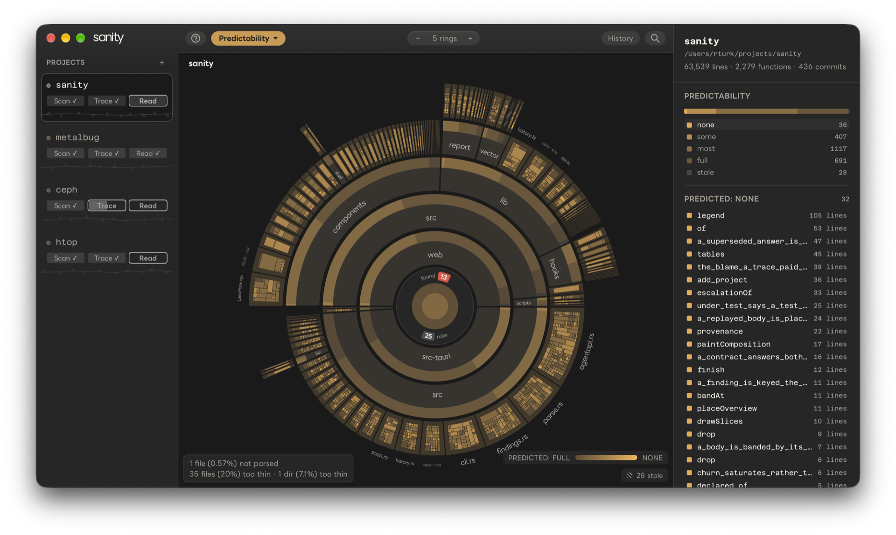
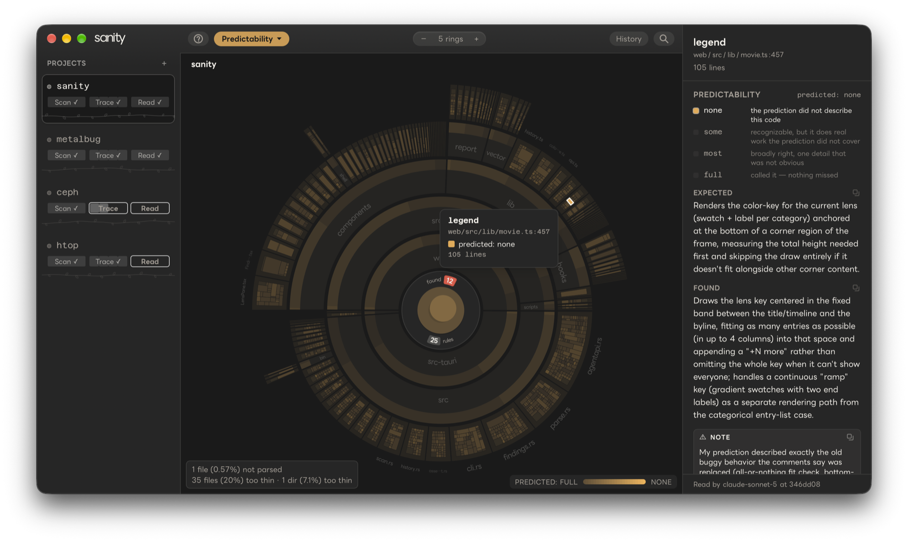
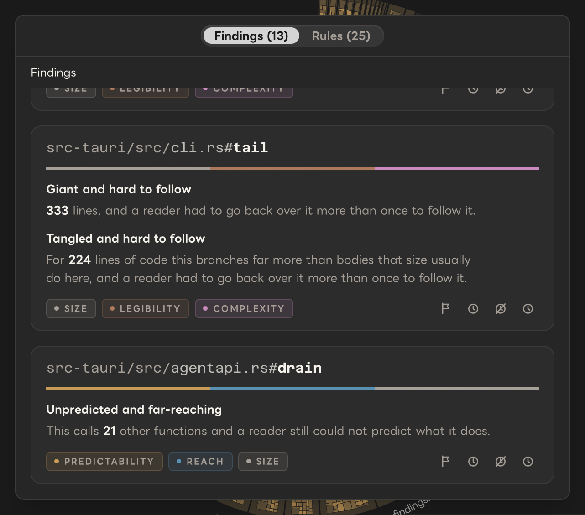
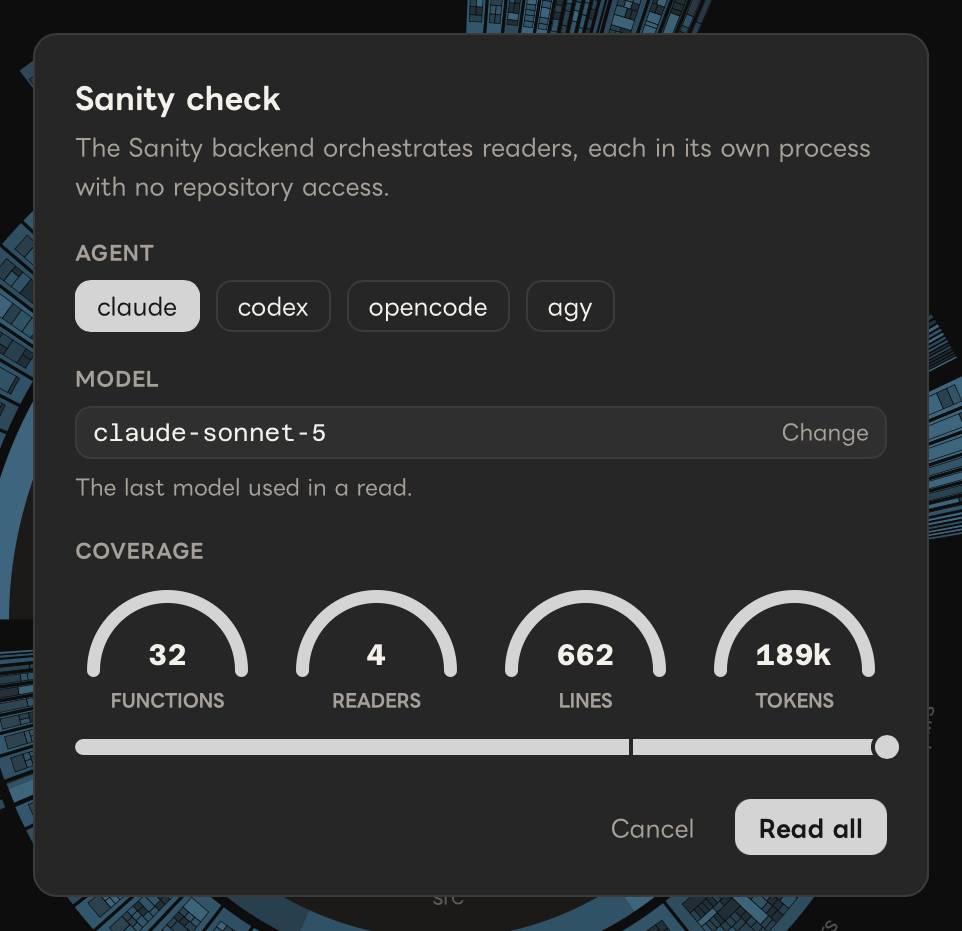

# Sanity

**Sanity measures how well a coding agent can predict each function in a repo from its
context, and points out the code it couldn't.**

A coding agent is shown each function's name, signature, neighbors and comments, but not its
body, and predicts what it does. Then it reads the code. Where the prediction held, the code
is probably routine. Where it missed, something in the code isn't evident from its name,
signature or comments, and the next person to read it, or the next agent, is likely to miss it
too. When the reader finds something likely to break for the next person who edits it, with
nothing in the code warning about it, it records a **trap**.

It's for anyone maintaining a codebase, including one an agent wrote. Sanity doesn't send
your code anywhere: the agent you already use does the reading, and the results are saved as
Markdown in your repo.

Most of Sanity costs nothing. Nine of its thirteen lenses and History need no agent and no
tokens, because they come from parsing the code and reading its git history. They show you
how big and tangled the code is, what calls what, where it's duplicated and how it has
changed. Findings work without an agent too, and on a repo nobody has read yet they mostly
point at the large, tangled code worth reading first. Readings are what you add when you
want to know where the code will trip someone up.

How the pieces fit:

- **Readings** measure each function: how well a reader predicted it, how hard it was to
  follow, and any traps.
- **Rules** combine readings with size, dependencies and history to produce **findings**.
- **Decisions** record what you chose to do about each finding.
- **`sanity verify`** checks, in CI, that the readings still describe the code.

All of it is committed with the repo, so it goes wherever the code goes.



## Understanding a repo

Sanity draws the repo as a sunburst: the repo in the middle, directories and files as rings
around it, and every function on the outer edge, sized by its line count. You choose what the
color shows: how well an agent could predict the code, how hard it was to follow, whether
it's documented, how complex it is, what calls it, who worked on it last, how old it is, how
often it changes, and more; [docs/lenses.md](docs/lenses.md) lists every lens. Click any
function to see its code and everything Sanity knows about it. **History** replays the repo
one commit at a time, so you can watch it grow.



The most useful of these measurements come from **readings**, the predictions described
above. Besides how far off its prediction was, each reading records how hard the code was to
follow, whether the comments helped, and any traps the reader found.

## Finding what needs work

Sanity also gives you a list of specific places that need attention, and says why each one
is on it. For example:

- a 1,000-line function that a reader had to go back over more than once to follow
- a function twenty others depend on that nobody has read
- a function whose comments describe something other than what it does
- a trap in code people are still editing: something a reader expects to break for the next
  person who edits it, with nothing in the code to warn them
- code copied into several places, where one copy changed and the others didn't

Each item is a **finding**, and each finding comes from a **rule** that combines a few
measurements. You decide on each one: fix it, snooze it, mark it wrong or accept it, and the
decision is committed with the repo. [docs/findings.md](docs/findings.md) covers findings,
decisions and how rules work; [docs/rules.md](docs/rules.md) has every field and how to
write your own.

<p align="center"></p>

A hard-to-predict function isn't always a problem. It might be a careful algorithm or it
might be a mess. Git history helps tell them apart:

|  | **Rarely changes** | **Changes often** |
|---|---|---|
| **Hard to predict** | Probably intricate and important. Document it and be careful with it. | Probably a problem. |
| **Easy to predict** | Routine. Worth a look only if there's a lot of it. | Routine work. Usually fine. |

## Getting started

```sh
brew install --cask monsterdept/tap/sanity
cd your-repo
sanity                                        # open the app, then add this repo from there
sanity findings                               # what needs work, and why

# Readings start here: an agent does the reading, and it spends tokens
sanity init --harness claude --model sonnet   # which agent reads, and with which model
sanity check --limit 50                       # take 50 readings
sanity findings                               # now with the rules that need readings
git add .sanity && git commit -m "Readings"
```

Nothing before `sanity init` needs an agent.

## What you need

- **Sanity itself.** See [Installation](#installation).
- **A coding agent, installed and signed in**, only for readings: Claude Code (`claude`),
  Codex (`codex`), OpenCode (`opencode`) or Antigravity (`agy`). Sanity never calls a model
  itself and doesn't need an API key.

**What readings cost.** Cost depends on how many functions and file headers there are to read,
and how long they are. `sanity status` shows how many are left.

| Reader | Per function | 1,000 functions |
|---|---|---|
| Claude Code | ~5,300 tokens | ~5M tokens |

That is the only reader measured so far: about 23,000 tokens for a reader to start, then about
3,000 per function, at ten functions per session. Other agents and models haven't been measured.

A cheaper reader isn't a cheaper version of the same measurement (see
[why trust the signal](#why-trust-the-signal)). Start with `sanity check --limit 50`
to see what a pass is like before reading everything.

<p align="center"></p>

To leave parts of a repo out, list them in a `.sanityignore` at the root. They're still drawn
on the map, but they aren't read and don't count toward coverage.

## The CLI

Every command takes a repo path and defaults to the current directory, and `sanity <command>
--help` lists its options. [docs/cli.md](docs/cli.md) covers every command: taking readings,
seeing results, deciding on findings, verifying, exporting, and the MCP server.

## Installation

| Platform | Download |
|---|---|
| macOS (Apple silicon) | `brew install --cask monsterdept/tap/sanity`, or the `.dmg` from [sanity.monster](https://sanity.monster) |
| Linux x86-64 | `.deb` or `.AppImage` from [sanity.monster](https://sanity.monster) |
| Windows x86-64 / arm64 | `.exe` installer from [sanity.monster](https://sanity.monster) |

The app and the CLI are one program. The Homebrew cask puts `sanity` on your `PATH`. If you
installed another way, open the app and press **Install sanity command** on the welcome
screen. It links `sanity` into `/usr/local/bin` or `~/.local/bin`. Don't add the app bundle
to your `PATH` or make an alias for it: other programs it needs live next to it, and scripts
can't see aliases.

## In CI

You take readings on your own machine and commit them; CI only checks what you committed.
`sanity verify` fails unless every function in scope has a reading, none is out of date, and
all were taken with the same model. It needs no git history, network access or credentials.
[docs/ci.md](docs/ci.md) has the GitHub Action,
[`monsterdept/sanity-action`](https://github.com/monsterdept/sanity-action), and how to run
`verify` anywhere else.

## Why trust the signal

Sanity works from a hypothesis: routine code is code a model can predict from its context. If
a reader predicts a function well, there probably isn't much in it you'd need to learn. If it
doesn't, something in there isn't obvious. This is a working assumption, not an established
result.

Sanity doesn't measure correctness, security, performance or whether the architecture is
right. A model can predict code that's wrong, and be puzzled by code that's fine. Readings
tell you where the code is surprising, and [git history](#finding-what-needs-work)
helps tell intricate from messy.

Comments are part of the context the reader predicts from. A comment that explains an
unusual function helps the reader predict it, so the function scores better. A comment that
just restates the code (`// increments the counter`) doesn't help. A comment that's out of
date makes things worse: the reader predicts what the comment says, and the code does
something else. Readers also note whether a comment could have been written from the code
alone. By default those comments don't count as documentation, so generating comments with a
model won't improve the numbers.

**The model you read with sets the scale.** Different models give different readings. A
smaller model is surprised by more, and in one comparison a weaker model also graded its own
misses more leniently. So readings from different models can't be compared. Sanity records
the model and agent for every reading. Use one model for a repo, and `verify` will check that you did.

Each reader runs as its own process, outside the repo and without your project settings, with
only the tools it needs. This matters: an agent that has already been working in the repo
knows what the code does, and its "predictions" would just be memory.

Sanity never calls a model and needs no API key. The agent you already use does the reading,
and sends what it reads to its own model, as it would in any other session. Readings expire
when the code or comments they describe change (see [below](#readings-live-in-the-repo)), and
`verify` catches any that are missing, stale or from a different model.

## Readings live in the repo

A reading takes an agent minutes and can't be recreated exactly, so Sanity keeps readings
in the repo they describe, at `.sanity/`, as Markdown meant to be read by people. Open
`.sanity/readings/*.md` and you'll see something like notes from a code review.

- **There's one file per top-level directory**, in source order, so two people taking
  readings in the same repo don't get merge conflicts.
- **Readings expire.** Each one records a hash of the code and comments it was taken
  against. When those change, the reading is marked stale and goes to the front of the queue.
- **Anyone can add to them.** Each reading records who took it, with which model and agent.
  That's a record of where it came from, not ownership.

`.sanity/rules/` holds the rules that produce findings, and `.sanity/findings/decisions.md`
holds your decisions. Please don't edit readings by hand. An edited reading describes a
measurement nobody took.

## The app

`sanity` with no arguments opens the app. The repo is in the center, directories and files
are rings around it, and functions are on the outer edge. A wedge's width is its size in
lines. Its color depends on which lens you pick; see [docs/lenses.md](docs/lenses.md).

Click a wedge to zoom in. The side panel explains what the lens says about it and shows the
code. The findings list, the rules editor and your decisions are in the app too.

**History** replays the repo one commit at a time. As you move through commits, the rings
grow, shrink and change color the way the code did. Because `.sanity/` is committed, the
reading lenses work in a replay too: each commit shows the readings that existed at that
point.

https://github.com/user-attachments/assets/c7cd432e-bb55-49fd-ae9a-8ac7a7306932

**Export** makes a PDF report (methodology, one section per lens, and findings grouped by
where they are), a shorter brief, a 16:9 slide deck, and an MP4 of a replay. Use File →
Export Report as PDF… (⇧⌘E).

Sanity parses 63 languages with tree-sitter, including Rust, TypeScript, Python, Go, Swift, C,
C++, Java, Kotlin, C#, Ruby, PHP, Elixir, Scala, Zig, Haskell and shell. Files in other
languages still show up on the map, but without functions.

## Contributing

[CONTRIBUTING.md](CONTRIBUTING.md) covers how to send a change, building from source, and
running the same checks CI runs.

[docs/](docs/README.md) has the rest: the architecture, one note per area, and plans (finished
and open).

## License

Sanity is free software under the [GNU General Public License, version 3 or later](LICENSE).
The GitHub Action, [`monsterdept/sanity-action`](https://github.com/monsterdept/sanity-action),
is under the MIT license.

What Sanity writes into your repo is yours. The `.sanity/` directory holds your readings,
rules and decisions, and the text Sanity puts there, such as its README and the rule
descriptions, is dedicated to the public domain under
[CC0 1.0](https://creativecommons.org/publicdomain/zero/1.0/). Committing `.sanity/` adds no
license terms to your repo.
