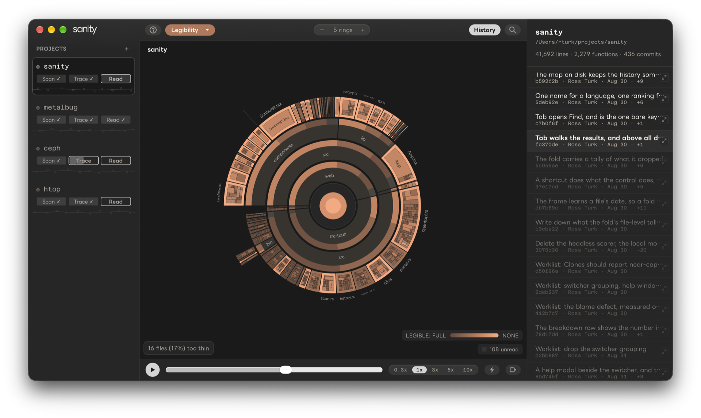

# Sanity

Sanity helps you understand a repo, and points out the parts of it that need work.

## Understanding a repo

Sanity draws the repo as a sunburst: the repo in the middle, directories and files as rings
around it, and every function on the outer edge, sized by its line count. You choose what the
color shows: how well an agent could predict the code, how hard it was to follow, whether
it's documented, how complex it is, what calls it, who worked on it last, how old it is, how
often it changes, and more. Click any function to see its code and everything Sanity knows
about it. **History** replays the repo one commit at a time, so you can watch it grow.

The most useful of these measurements come from **readings**. A coding agent is shown a
function's name, signature, neighbors and comments, but not its body, and writes down what it
expects the function to do. Then it opens the file and reports how far off it was, how hard
the code was to follow, whether the comments helped, and anything likely to trip up the next
person who edits it. Code the agent predicted well is routine. Code it got wrong is where the
decisions are, and it's the code the next person (or the next agent) is likely to get wrong
too.

Readings are saved as Markdown in your repo, under `.sanity/`, so anyone can read them like
notes from a code review. They expire when the code they describe changes. A CI check can fail
a build whose readings are missing or out of date.

## Finding what needs work

Sanity also gives you a list of specific places that need attention, and says why each one
is on it. For example:

- a 1,000-line function that a reader had to go back over more than once to follow
- a function twenty others depend on that nobody has read
- a function whose comments describe something other than what it does
- code copied into several places, where one copy changed and the others didn't

Each item is a **finding**, and each finding comes from a **rule** that combines a few
measurements, like "over 200 lines, and hard to follow" or "depended on by ten or more
functions, and undocumented." Sanity comes with about two dozen rules, and you can change
their thresholds or turn them off for your repo.

```
$ sanity findings --limit 2
/Users/you/projects/sanity  14 findings

  web/src/components/Findings.tsx#Findings
    Giant and hard to follow
      1,012 lines, and a reader had to go back over it more than once to follow
      it. Anything that changes it has to hold all of it at once, and a reader
      already found that hard.
    Tangled and hard to follow
      For 720 lines of code this branches far more than bodies that size usually
      do here, and a reader had to go back over it more than once to follow it.

  web/src/App.tsx#App
    Unpredicted and far-reaching
      This calls 48 other functions and a reader still could not predict what it
      does. It coordinates work that is not apparent from its own body.
```

You decide on each finding: fix it, snooze it until the code changes, mark it wrong, or
accept it. Decisions are committed with the repo, so the list gets shorter as you work
through it, and your team sees the same list you do.

## Getting started

```sh
brew install --cask monsterdept/tap/sanity
cd your-repo
sanity init --harness claude --model sonnet   # which agent reads, and with which model
sanity check --limit 50                       # take 50 readings
sanity                                        # open the app
sanity findings                               # what needs work, and why
git add .sanity && git commit -m "Readings"
```

## Screenshots


*The map. Each wedge is a function; its width is its line count and its color is how well a
reader predicted it.*


*Click a function to see its reading: what the agent expected, what it found, and its grades.*


*Findings: places where several measurements agree something needs a look.*


*History replays the repo one commit at a time.*

## How you use it

1. **Take readings.** `sanity check` starts coding agents as readers. Each one predicts
   functions before it sees them. Sanity doesn't send your code anywhere; the agent sends
   what it reads to its own model, as it would in any other session.
2. **Look at findings.** `sanity findings` runs the rules over everything measured so far and
   lists what matches, most important first. Rules that don't need readings (size,
   duplication, history) work before you've taken any.
3. **Decide what to do about each one.** You can snooze a finding until the code changes,
   mark it wrong, allow it permanently, or flag it as work to do. Decisions are committed with
   the readings, so the whole team sees them.
4. **Check in CI.** `sanity verify` fails if any function has no reading, if a reading is out
   of date, or if readings were taken with different models.
5. **Keep them current.** When you change a function, its reading goes stale and moves to
   the front of the queue. The next `sanity check` reads it again.

## Changing the rules

`.sanity/rules/README.md` lists every rule that ran: its name, the conditions it checks, and
what it says about a match. That file is regenerated on every scan.

To change a rule for your repo, edit its line in `.sanity/rules/catalog.md`. Change a number
and it's used as written. Add `; off` to turn the rule off. Delete the line to go back to the
default. The rules editor in the app makes the same changes.

If the list is too long or too short to be useful, `sanity findings balance --target 20`
suggests thresholds that would give about 20 findings, and `--apply` saves them.

## What you need

- **Sanity itself.** See [Installation](#installation).
- **A coding agent, installed and signed in**, to take readings: Claude Code (`claude`), Codex
  (`codex`), OpenCode (`opencode`) or Antigravity (`agy`). Sanity never calls a model itself and
  doesn't need an API key.

Everything except taking readings works without an agent: the map, findings from the parts
that don't need readings, history and `verify`.

**What readings cost.** A reader uses about 23,000 tokens to get started and about 3,000 per
function, and reads ten functions per session. That's roughly 5,300 tokens per function, or
about five million tokens for a repo with a thousand functions. Start with `--limit` to see
what a pass is like before reading everything. `sanity status` shows how much is left.

To leave parts of a repo out, list them in a `.sanityignore` at the root. They're still drawn
on the map, but they aren't read and don't count toward coverage.

## The CLI

Every command takes a repo path and defaults to the current directory. `sanity <command>
--help` lists its options.

### Taking readings

```sh
sanity init --harness claude --model sonnet   # pick the agent and model for this repo
sanity check                                  # read until done, showing progress
sanity check --readers 8                      # run 8 readers at once
sanity check --limit 50                       # stop after 50 readings
sanity check --detach                         # start in the background and return
sanity status                                 # what the readers are doing, and how much is read
```

`--harness` takes `claude`, `codex`, `opencode` or `agy`. `--model` takes any model the agent
can use. If you stop a pass, you lose only the readings in progress. Finished readings are
saved as they come in, and the next `check` continues where it left off.

### Seeing results

```
$ sanity summary
Project: sanity
  2,455 segments (2,280 functions + 175 file headers)
  2,455 read (100.0%)
  0 unread (0.0%)
  0 stale (0.0%)

                 full   most   some   none
  PREDICTED       696  1,131    412     41
  DOCUMENTED      377    704    302    897
  LEGIBLE       1,905    269     91      0

  24 traps identified
  623 unhelpful doc strings found
```

Some findings depend on git history. `--edits` and `--blame` read that history first so those
findings can appear. On a large repo this takes a few minutes. `sanity trace` reads the same
history ahead of time.

### Deciding on findings

```sh
sanity findings snooze web/src/App.tsx#App --reason "rewrite planned for Q4"   # hide until this code changes
sanity findings allow  src/gen.rs#table                   # this is fine; don't show it again
sanity findings wrong  src/lib.rs#parse --rule giant-illegible   # the finding is wrong; hide until the rule changes
sanity findings flag   src/lib.rs#parse                   # this needs work; keep it listed
sanity findings clear  src/lib.rs#parse                   # undo a decision
sanity findings balance --target 20                       # suggest thresholds that give about 20 findings
sanity findings balance --target 20 --apply               # save them to .sanity/rules/catalog.md
```

### Checking, looking things up and exporting

```
$ sanity verify
  pass  complete        every unit has a reading
  pass  current         every reading describes the code as it stands
  pass  one instrument  claude-sonnet-5 via claude
```

```sh
sanity verify --model claude-sonnet-5         # require this specific model
sanity callers src/edges.rs#resolve           # what calls a function, matched by name
sanity trace --blame                          # per-line blame, so Age works per function
sanity export-data --out report.json          # all the data behind the report, as JSON
sanity refresh                                # rewrite .sanity/ in the current format
```

`sanity` with no arguments opens the app. `sanity mcp` runs an MCP server over stdio, so a
chat agent can open a project and read its status and summary. That agent can't take
readings: it has already seen the repo, so its predictions wouldn't mean anything.

## Installation

| Platform | Download |
|---|---|
| macOS (Apple silicon) | `brew install --cask monsterdept/tap/sanity`, or the `.dmg` from [sanity.monster](https://sanity.monster) |
| Linux x86-64 | `.deb` or `.AppImage` from [sanity.monster](https://sanity.monster) |
| Windows x86-64 / arm64 | `.exe` installer from [sanity.monster](https://sanity.monster) |

The app and the CLI are one program. The Homebrew cask puts `sanity` on your `PATH`. If you
installed another way, open the app and press **Install sanity command** on the welcome
screen. It links `sanity` into `/usr/local/bin` or `~/.local/bin`. Don't add the app bundle
to your `PATH` or make an alias for it: other programs it needs live next to it, and scripts
can't see aliases.

## In CI

You take readings on your own machine, against the code you're about to ship, and commit
them. CI doesn't take readings, because that would mean putting model credentials in CI. It
only checks what you committed. `sanity verify` fails unless the readings are:

- **complete**: every function and file in scope has a reading;
- **current**: no reading is out of date for the code that's checked out, and none was taken
  with an older version of the questions;
- **from one model**: every reading was taken with the same agent and model. `--model` and
  `--harness` require a specific one. `--mixed` turns this check off but still prints what
  was used.

`verify` doesn't need git history, network access or credentials.

### GitHub Actions

[`monsterdept/sanity-action`](https://github.com/monsterdept/sanity-action) runs `verify` on a
Linux x86-64 runner:

```yaml
name: Readings
on: [pull_request]

jobs:
  verify:
    runs-on: ubuntu-latest
    steps:
      - uses: actions/checkout@v7
      - uses: monsterdept/sanity-action@v1
        with:
          version: 0.31.1          # the Sanity release your team reads with
          model: claude-sonnet-5   # optional: require this model
          # harness: claude        # optional: require this agent
          # path: services/api     # optional: a repo in a subdirectory
          # consistent-reader: false   # optional: allow mixed models
```

**Pin `version`.** A new release can change the parser or the questions, which can make
existing readings out of date. Pinning means your check only changes when you decide to
upgrade.

To check releases instead of pull requests, add the job before your build with `needs:`.
Sanity checks its own releases this way: see
[`.github/workflows/readings.yml`](.github/workflows/readings.yml).

### Other CI systems

Download the `.AppImage` for your pinned version and run it:

```sh
curl -fsSLo sanity https://dl.dept.monster/sanity/Sanity_0.31.1_amd64.AppImage
chmod +x sanity
APPIMAGE_EXTRACT_AND_RUN=1 ./sanity verify "$PWD"   # use an absolute path: the AppImage starts in its own directory
```

`APPIMAGE_EXTRACT_AND_RUN=1` is needed on runners without `libfuse2`.

## What the readings measure

The idea behind Sanity is that routine code is code a model can predict from its context. If
a reader predicts a function well, there isn't much in it you'd need to learn. If it doesn't,
something in there isn't obvious.

Comments are part of the context the reader predicts from. A comment that explains an
unusual function helps the reader predict it, so the function scores better. A comment that
just restates the code (`// increments the counter`) doesn't help. A comment that's out of
date makes things worse: the reader predicts what the comment says, and the code does
something else. Readers also note whether a comment could have been written from the code
alone. By default those comments don't count as documentation, so generating comments with a
model won't improve the numbers.

**The model you read with sets the scale.** A smaller model is surprised by more things, so
readings from different models can't be compared. Sanity records the model and agent for
every reading. Use one model for a repo, and `verify` will check that you did.

Each reader runs as its own process, outside the repo and without your project settings, with
only the tools it needs. This matters: an agent that has already been working in the repo
knows what the code does, and its "predictions" would just be memory.

A hard-to-predict function isn't always a problem. It might be a careful algorithm or it
might be a mess. Git history helps tell them apart:

|  | **Rarely changes** | **Changes often** |
|---|---|---|
| **Hard to predict** | Probably intricate and important. Document it and be careful with it. | Probably a problem. |
| **Easy to predict** | Routine. Worth a look only if there's a lot of it. | Routine work. Usually fine. |

## Readings live in the repo

A reading takes an agent minutes and can't be recreated exactly, so Sanity keeps readings
in the repo they describe, at `.sanity/`, as Markdown meant to be read by people. Open
`.sanity/readings/*.md` and you'll see something like notes from a code review.

- **There's one file per top-level directory**, in source order, so two people taking
  readings in the same repo don't get merge conflicts.
- **Readings expire.** Each one records a hash of the code and comments it was taken
  against. When those change, the reading is marked stale and goes to the front of the queue.
- **Anyone can add to them.** Each reading records who took it, with which model and agent.
  That's a record of where it came from, not ownership.

`.sanity/rules/` holds the rules that produce findings, and `.sanity/findings/decisions.md`
holds your decisions. Please don't edit readings by hand. An edited reading describes a
measurement nobody took.

## The app

`sanity` with no arguments opens the app. The repo is in the center, directories and files
are rings around it, and functions are on the outer edge. A wedge's width is its size in
lines. Its color depends on which lens you pick:

| Group | Lens | What it shows | Needs |
|---|---|---|---|
| **Code shape** | Complexity | How complex it is for its size | only the scan |
| | Composition | Whether it's hand-written, a test, generated, vendored or a header | |
| | Language | What language it's in | |
| | Clones | Whether it's a copy of other code | |
| **Interconnectivity** | Callers | How many things call it | a language whose calls Sanity can read |
| | Reach | How much it calls | |
| **Activity** | Blame | Who changed it last | git history |
| | Age | How long since it changed | |
| | Churn | How much it has changed recently | |
| **Assessment** | Predictability | How well a reader predicted it | readings |
| | Legibility | How hard it was to read | |
| | Docs | What isn't explained | |
| | Traps | What's likely to trip up the next person who edits it | |

Click a wedge to zoom in. The side panel explains what the lens says about it and shows the
code. The findings list, the rules editor and your decisions are in the app too.

**History** replays the repo one commit at a time. As you move through commits, the rings
grow, shrink and change color the way the code did. Because `.sanity/` is committed, the
reading lenses work in a replay too: each commit shows the readings that existed at that
point.

**Export** makes a PDF report (methodology, one section per lens, and findings grouped by
where they are), a shorter brief, a 16:9 slide deck, and an MP4 of a replay. Use File →
Export Report as PDF… (⇧⌘E).

Sanity parses 63 languages with tree-sitter, including Rust, TypeScript, Python, Go, Swift, C,
C++, Java, Kotlin, C#, Ruby, PHP, Elixir, Scala, Zig, Haskell and shell. Files in other
languages still show up on the map, but without functions.

## Building from source

```sh
just setup                      # once: frontend dependencies and the Tauri CLI (needs Rust and Node)
just dev                        # run the app
just cli findings ../some-repo  # run the CLI built from this checkout
```

On Linux, install the WebKit and GTK development packages first:
`libwebkit2gtk-4.1-dev libgtk-3-dev libayatana-appindicator3-dev librsvg2-dev libxdo-dev`.

`just check` type-checks. `just test` runs the same steps as CI, in the same order, so if it
passes locally, CI will pass.

[docs/](docs/README.md) has the rest: the architecture, one note per area, and plans (finished
and open).
