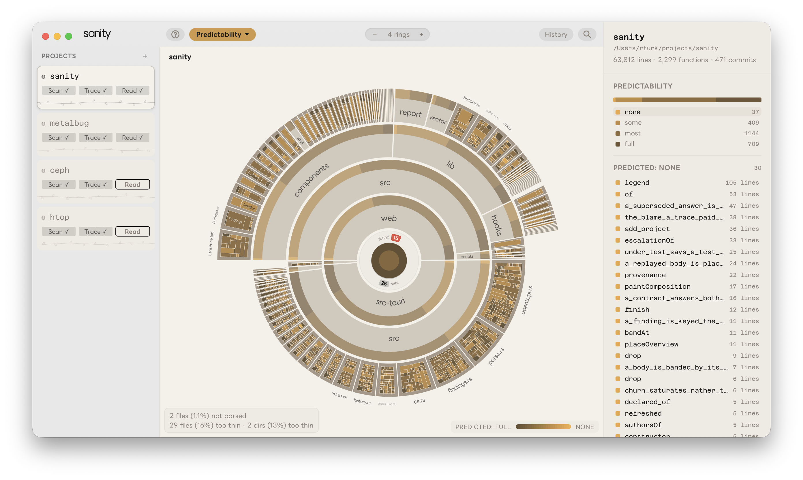
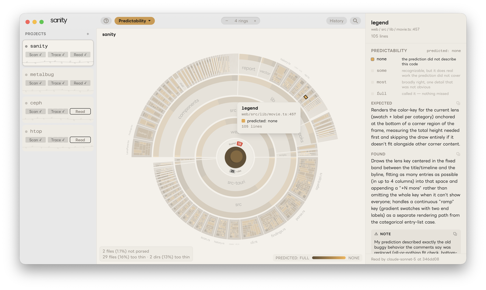
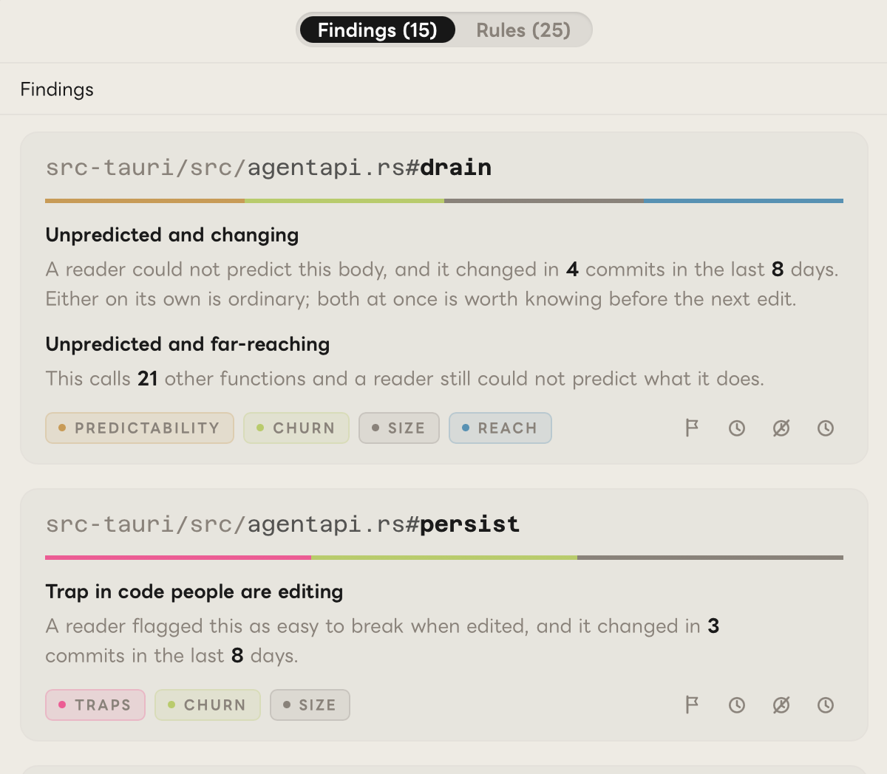
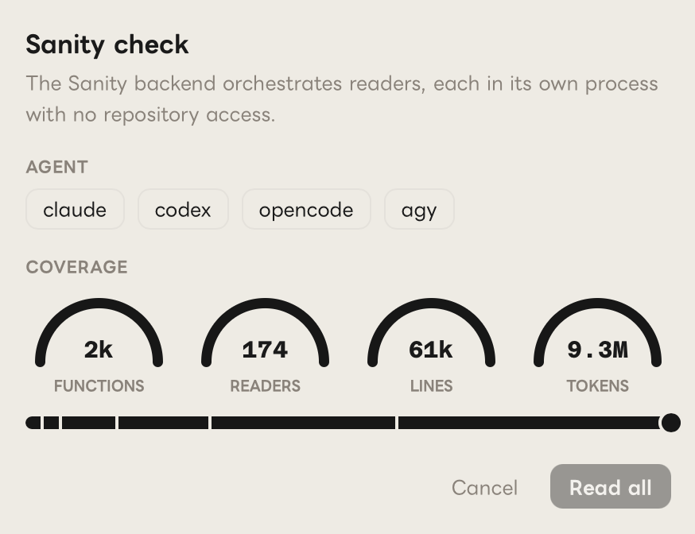

# Sanity

**Sanity draws a repo as a map you can explore, and measures where its code will be hard for the next person to follow.**

Sanity is for anyone maintaining a codebase, including one an agent wrote. It comes in three parts:

- **An app** for exploring a repo. Its directories, files and functions share one map, colored by whatever you want to look at: size, complexity, who works where, what changes, which functions have the most callers and which call the most.
- **A CLI** for taking quality readings. A coding agent is shown each function's name, signature, neighbors and comments, predicts what the function does, then reads it. Where the prediction missed, something in the code isn't evident from the outside. The reader also flags any **trap**: something likely to break for the next person who edits it, with nothing in the code to warn them.
- **A GitHub Action** that fails a build when the readings are missing, out of date, or taken with more than one model.

You can use it two ways. The first is to see a repo: how it's laid out, what's big, what's tangled, what keeps changing. That needs no agent and costs nothing. The second is to find where the code will trip someone up, which is what readings are for. Readings cost tokens.

## Getting started

```sh
brew install --cask monsterdept/tap/sanity         # macOS
curl -fsSL https://sanity.monster/install.sh | sh  # Linux
cd your-repo
sanity .                                           # open this repo in the app
sanity findings                                    # what needs work, and why

# Readings start here: an agent does the reading, and it spends tokens
sanity init --harness claude --model sonnet        # which agent reads, and with which model
sanity check --limit 50                            # take 50 readings, starting with what findings listed
sanity findings                                    # now with the rules that need readings
git add .sanity && git commit -m "Readings"
```

## How Sanity works

Sanity doesn't send your code anywhere new: the agent you already use does the reading, and the results are saved as Markdown in your repo.

- **Traces** read the repo's git history: how old each function is, how often it changes, and who has worked on it.
- **Readings** measure each function: how well a reader predicted it, how hard it was to follow, and any traps.
- **Rules** combine traces and readings with each function's size and dependencies to produce **findings**.
- **Decisions** record what you chose to do about each finding.
- **`sanity verify`** checks, in CI, that the readings still describe the code.

All of it is committed with the repo, so it goes wherever the code goes.

<picture>
  <source media="(prefers-color-scheme: dark)" srcset="docs/images/map-dark.png">
  <source media="(prefers-color-scheme: light)" srcset="docs/images/map-light.png">
  
</picture>

## Understanding a repo

Sanity draws the repo as a sunburst: the repo in the middle, directories and files as rings around it, and functions on the outer edge, sized by their line counts.

You choose what the color shows: how well an agent could predict the code, how hard it was to follow, whether it's documented, how complex it is, how many places call it, how many functions it calls, who worked on it last, how old it is, how often it changes, and more; [docs/lenses.md](docs/lenses.md) lists every lens.

<picture>
  <source media="(prefers-color-scheme: dark)" srcset="docs/images/reading-dark.png">
  <source media="(prefers-color-scheme: light)" srcset="docs/images/reading-light.png">
  
</picture>

The most useful of these measurements come from **readings**, the predictions described above. Besides how far off its prediction was, each reading records how hard the code was to follow, whether the comments helped, and any traps the reader found.

## Finding what needs work

Sanity also gives you a list of specific findings, places that need attention. Each finding comes from a rule that combines a few measurements. For example:

- a 1,000-line function that a reader had to go back over more than once to follow
- a function twenty others depend on that nobody has read
- a function whose comments describe something other than what it does
- a heavily-edited function that contains a trap
- code copied into several places, where one copy changed and the others didn't

You decide on each finding: fix it, snooze it, mark it wrong or accept it, and the decision is committed with the repo. For findings, decisions and how rules work, see [docs/findings.md](docs/findings.md); for every field and how to write your own rule, see [docs/rules.md](docs/rules.md).

<p align="center">
<picture>
  <source media="(prefers-color-scheme: dark)" srcset="docs/images/findings-dark.png">
  <source media="(prefers-color-scheme: light)" srcset="docs/images/findings-light.png">
  
</picture>
</p>

Rules are designed to combine multiple signals. For example, a hard-to-predict function isn't always a problem. It might be a careful algorithm or it might be a mess. Git history helps tell them apart:

|  | **Rarely changes** | **Changes often** |
|---|---|---|
| **Hard to predict** | Probably intricate and important. Document it and be careful with it. | Probably a problem. |
| **Easy to predict** | Routine. Worth a look only if there's a lot of it. | Routine work. Usually fine. |

The "Probably a problem" cell is why the "Unpredicted and changing" rule asks for both at once:

```
func: surprise >= 0.6 and commits >= 4 and ncloc >= 10
```

A reader couldn't predict it, and it has changed in at least four commits recently. How recent depends on the repo's history, and each finding says how many days it counted. The size clause leaves out bodies under ten lines of code, where there's too little to predict.

## What you need

- **Sanity itself.** See [Installation](#installation).
- **A coding agent, installed and signed in**, only for readings: Claude Code (`claude`), Codex (`codex`), OpenCode (`opencode`) or Antigravity (`agy`). Sanity never calls a model itself and doesn't need an API key.

**What readings cost.** Cost depends on how many functions and file headers there are to read, and how long they are. To see how many are left, run `sanity status`.

| Reader | Per function | 1,000 functions |
|---|---|---|
| Claude Code | ~5,300 tokens (at 10 per session) | ~5M tokens |

That is the only reader measured so far: about 23,000 tokens for a reader to start, then about 3,000 per function, at ten functions per session. Other agents and models haven't been measured.

A cheaper reader isn't a cheaper version of the same measurement (see [why trust the signal](#why-trust-the-signal)). Start with `sanity check --limit 50` to see what a pass is like before reading everything.

<p align="center">
<picture>
  <source media="(prefers-color-scheme: dark)" srcset="docs/images/read-dialog-dark.png">
  <source media="(prefers-color-scheme: light)" srcset="docs/images/read-dialog-light.png">
  
</picture>
</p>

To leave parts of a repo out, list them in a `.sanityignore` at the root. They're still drawn on the map, but they aren't read and don't count toward coverage.

## The CLI

Every command takes a repo path and defaults to the current directory, and `sanity <command> --help` lists its options. The full reference is [docs/cli.md](docs/cli.md), covering every command: taking readings, seeing results, deciding on findings, verifying, exporting, and the MCP server.

## Installation

| Platform | Download |
|---|---|
| macOS (Apple silicon) | `brew install --cask monsterdept/tap/sanity`, or the `.dmg` from [sanity.monster](https://sanity.monster) |
| Linux x86-64 / arm64 | `curl -fsSL https://sanity.monster/install.sh \| sh`, or the `.deb`, `.rpm` or `.AppImage` from [sanity.monster](https://sanity.monster) |
| Windows x86-64 / arm64 | `.exe` installer from [sanity.monster](https://sanity.monster) |

The app and the CLI are one program. The Homebrew cask puts `sanity` on your `PATH`, and the install script puts it in `~/.local/bin`, saying so if that isn't on your `PATH`. If you installed another way, open the app and press **Install sanity command** on the welcome screen. It links `sanity` into `/usr/local/bin` or `~/.local/bin`. Don't add the app bundle to your `PATH` or make an alias for it: other programs it needs live next to it, and scripts can't see aliases.

## In CI

You take readings on your own machine and commit them. CI only checks what you committed. Its check, `sanity verify`, fails unless every function in scope has a reading, none is out of date, and all were taken with the same model. It needs no git history, network access or credentials. To use the GitHub Action, [`monsterdept/sanity-action`](https://github.com/monsterdept/sanity-action), or to run `verify` anywhere else, see [docs/ci.md](docs/ci.md).

## Why trust the signal

Sanity works from a hypothesis: routine code is code a model can predict from its context. If a reader predicts a function well, there probably isn't much in it you'd need to learn. If it doesn't, something in there isn't obvious. This is a working assumption, not an established result.

Sanity doesn't measure correctness, security, performance or whether the architecture is right. A model can predict code that's wrong, and be puzzled by code that's fine. Readings tell you where the code is surprising, and git history helps tell intricate from messy: see the table under [Finding what needs work](#finding-what-needs-work).

Comments are part of the context the reader predicts from. A comment that explains an unusual function helps the reader predict it, so the function scores better. A comment that just restates the code (`// increments the counter`) doesn't help. A comment that's out of date makes things worse: the reader predicts what the comment says, and the code does something else. Readers also note whether a comment could have been written from the code alone. By default those comments don't count as documentation, so generating comments with a model won't improve the numbers.

**The model you read with sets the scale.** Different models give different readings. A smaller model is surprised by more, and in one comparison a weaker model also graded its own misses more leniently. So readings from different models can't be compared. Sanity records the model and agent for every reading. Use one model for a repo, and `verify` will check that you did.

Each reader runs as its own process, outside the repo and without your project settings, with only the tools it needs. This matters: an agent that has already been working in the repo knows what the code does, and its "predictions" would just be memory.

The reader sends what it reads to its own model, as it would in any other session. Readings expire when the code or comments they describe change (see [below](#readings-live-in-the-repo)), and `verify` catches any that are missing, stale or from a different model.

## Readings live in the repo

A reading takes an agent minutes and can't be recreated exactly, so Sanity keeps readings in the repo they describe, at `.sanity/`, as Markdown meant to be read by people. Open `.sanity/readings/*.md` and you'll see something like notes from a code review.

- **There's one file per top-level directory**, in source order, so two people taking readings in the same repo don't get merge conflicts.
- **Readings expire.** Each one records a hash of the code and comments it was taken against. When those change, the reading is marked stale and goes to the front of the queue.
- **Anyone can add to them.** Each reading records who took it, with which model and agent. That's a record of where it came from, not ownership.

`.sanity/rules/` holds the rules that produce findings, and `.sanity/findings/decisions.md` holds your decisions. Please don't edit readings by hand. An edited reading describes a measurement nobody took.

## The app

To open the app on the repo you're in, run `sanity .`, or just `sanity` from inside a repo. The map is the one described under [Understanding a repo](#understanding-a-repo).

Click a wedge to zoom in. The side panel explains what the lens says about it and shows the code. The findings list, the rules editor and your decisions are in the app too.

**History** replays the repo one commit at a time. As you move through commits, the rings grow, shrink and change color the way the code did. Because `.sanity/` is committed, the reading lenses work in a replay too: each commit shows the readings that existed at that point.

https://github.com/user-attachments/assets/c7cd432e-bb55-49fd-ae9a-8ac7a7306932

**Export** makes a PDF report (methodology, one section per lens, and findings grouped by where they are), a shorter brief, a 16:9 slide deck, and an MP4 of a replay. Use File → Export Report as PDF… (⇧⌘E).

Sanity parses 63 languages with tree-sitter, including Rust, TypeScript, Python, Go, Swift, C, C++, Java, Kotlin, C#, Ruby, PHP, Elixir, Scala, Zig, Haskell and shell. Files in other languages still show up on the map, but without functions.

## Contributing

[CONTRIBUTING.md](CONTRIBUTING.md) covers how to send a change, building from source, and running the same checks CI runs.

The rest is in [docs/](docs/README.md): the architecture, one note per area, and plans (finished and open).

## License

Sanity is free software under the [GNU General Public License, version 3 or later](LICENSE). The GitHub Action, [`monsterdept/sanity-action`](https://github.com/monsterdept/sanity-action), is under the MIT license.

What Sanity writes into your repo is yours. The `.sanity/` directory holds your readings, rules and decisions, and the text Sanity puts there, such as its README and the rule descriptions, is dedicated to the public domain under [CC0 1.0](https://creativecommons.org/publicdomain/zero/1.0/). Committing `.sanity/` adds no license terms to your repo.
